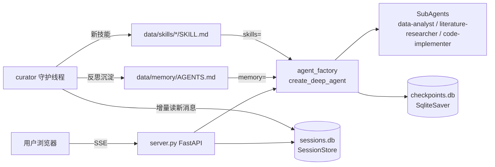

# coding — 科研 Agent 框架

基于 [deepagents](https://github.com/langchain-ai/deepagents) 的科研 Agent 框架：本地一键拉起、Web 前端、多会话管理、自动持久化、自定义 SubAgents、后台自进化。

## 架构

```
coding/
├── config.py          # 配置中心：路径 / 模型环境变量 / 默认参数
├── session_store.py   # 会话持久化（SQLite：sessions + messages + curator 审阅水位）
├── subagents.py       # 自定义 SubAgents（deepagents SubAgent 规范）
├── agent_factory.py   # Agent 工厂：模型 + 工具 + 技能 + SqliteSaver checkpointer
├── curator.py         # 自进化子代理：监视会话 → 沉淀 memory/skills
├── server.py          # FastAPI：SSE 流式对话 + 会话 API + outputs 文件预览
├── cli.py             # 命令行调试入口
├── static/index.html  # 前端（多会话侧栏 + Markdown/表格/多媒体渲染，零外部依赖）
├── data/              # 运行时数据（git 忽略）：sessions.db / checkpoints.db / memory / skills / curator 日志
└── tests/             # pytest 单测，各模块独立可测
```

数据流：



## 快速开始

```bash
# 1. 安装依赖（仓库根目录）
uv sync

# 2. 确认 .env 里配置了 BRAIN_API_KEY / BRAIN_API_URL / BRAIN_MODEL_NAME
#    （可选：OPTIMIZER_* 给 curator 用，缺省回退主模型）

# 3. 启动服务（自动拉起 curator 后台线程）
uv run python -m coding.server --port 8321
# 打开 http://127.0.0.1:8321

# 命令行调试
uv run python -m coding.cli "你好，介绍一下你能做什么"
uv run python -m coding.cli --list          # 列出会话
uv run python -m coding.cli --session <id> "继续"

# 只调试 curator
uv run python -m coding.curator --once      # 前台跑一轮
```

## 核心设计

### 多会话管理
- `SessionStore`（SQLite）：sessions 元数据 + messages 全量消息流，线程安全。
- `SqliteSaver` checkpointer：Agent 状态按 `thread_id = session_id` 持久化，重启后上下文无缝恢复。
- 前端侧栏支持新建 / 切换 / 重命名 / 删除会话，首条消息自动生成标题。

### SubAgents（deepagents 规范）
`subagents.py` 中每个 SubAgent 是标准 `SubAgent` TypedDict（name / description / system_prompt / tools / model），由主 Agent 通过内置 `task` 工具委派：
- `data-analyst`：数据处理、统计分析、图表与可视化
- `literature-researcher`：文献检索与结构化笔记
- `code-implementer`：代码实现与自测

### 自进化（curator，参考 Hermes curation）
守护线程每 120s 扫描一次所有会话中未审阅的消息（`last_curator_msg_id` 水位增量消费），达到阈值后交给 optimizer 模型驱动的反思 Agent：
1. 把稳定的用户偏好 / 环境事实 / 纠正式经验追加到 `data/memory/AGENTS.md`（经 `memory=` 注入主 Agent 系统提示）；
2. 把可复用多步工作流沉淀为 `data/skills/<name>/SKILL.md`（经 `skills=` 自动加载）。
审阅记录落 `data/curator.log.jsonl`。

### 前端
单文件 `static/index.html`，零 CDN 依赖：内置 Markdown 渲染（标题/列表/代码块/**表格**）、工具调用折叠步骤条、`outputs/` 下图片/视频/音频/文件的内联预览与外链（`/files/*` 带路径穿越防护）。

## API 一览

| 方法 | 路径 | 说明 |
|---|---|---|
| GET | `/api/health` | 健康检查 |
| GET/POST | `/api/sessions` | 会话列表 / 新建 |
| DELETE | `/api/sessions/{id}` | 删除会话 |
| PATCH | `/api/sessions/{id}/title` | 重命名 |
| GET | `/api/sessions/{id}/messages` | 历史消息 |
| POST | `/api/sessions/{id}/chat` | SSE 流式对话 |
| GET | `/files/{path}` | outputs/ 文件预览 |

## 测试

```bash
uv run pytest coding/tests -q
```

覆盖：session_store 水位与 CRUD、subagents 规范、server API（fake agent 注入）、curator 摘要/水位/异常、config。
